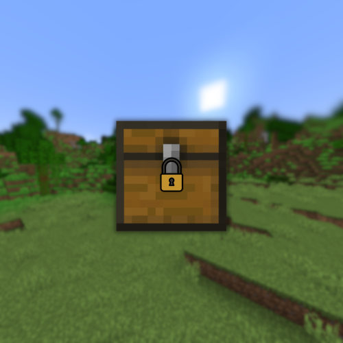

# Project Abandoned
# It was replaced with Homestead, [Click here](https://www.spigotmc.org/resources/%E2%9C%85-homestead-%E2%9A%94%EF%B8%8F-regions-grief-prevention-1-21.121873/)

<h3><samp>Velox Claim</samp></h3>

**VeloxClaimProtection**, or **Velox** is a Minecraft plugin allowing players to own a 16x16 block chunk within a Minecraft world and safeguard it against griefers and thieves. Highly customizable, it operates on a role-based system for trusted players, offering over **27** permissions per role. Utilizing SQLite as its primary database, this plugin include a robust cache system to prevent frequent database locks.

 

Still under development!
